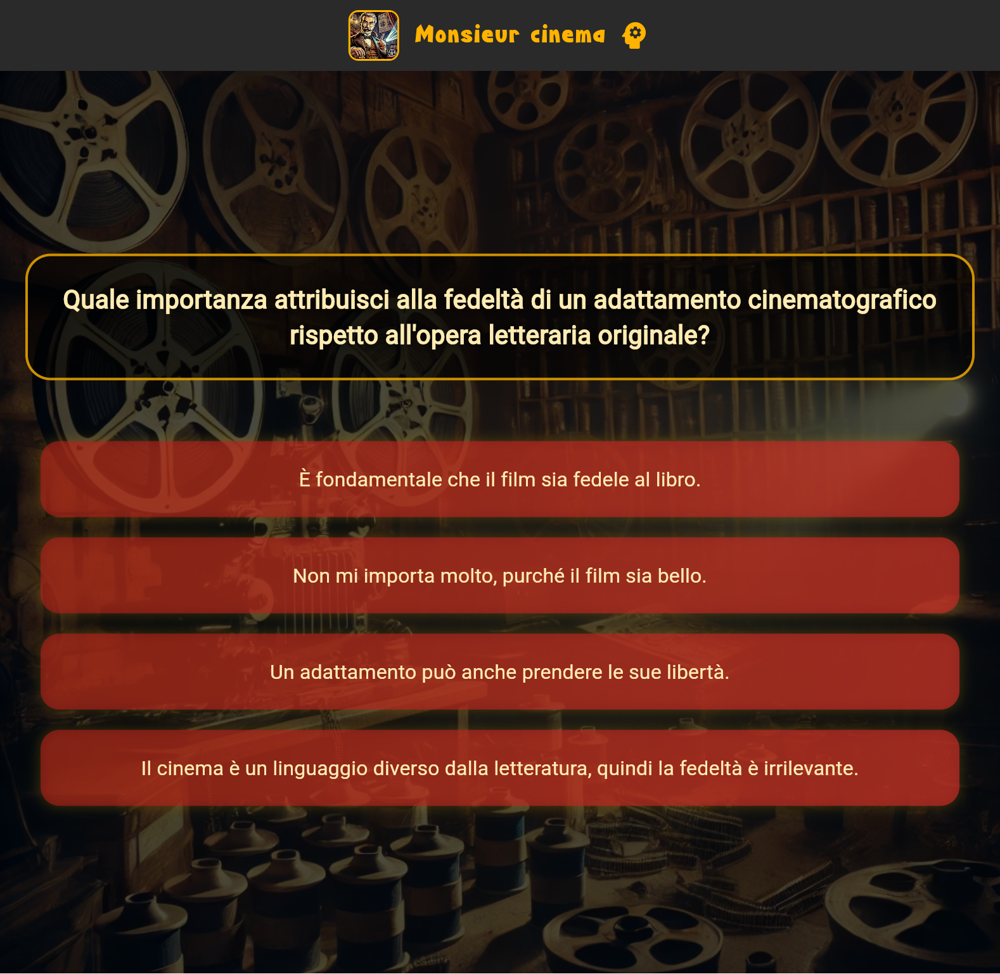
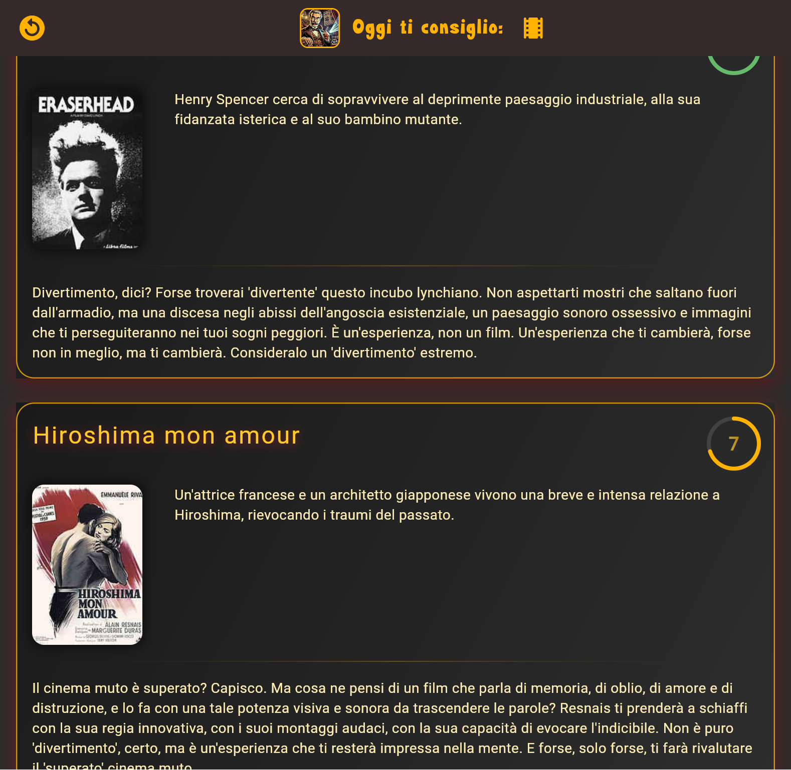

# CineMatch - AI Movie Recommendation App

CineMatch is a Flutter application that leverages the power of Artificial Intelligence to recommend movies tailored to
your individual tastes. This app utilizes extensive interaction with Large Language Models (LLMs) to understand your
preferences and suggest films you'll love.


**⚠️ Disclaimer: This software was created for experimental purposes only and should not be considered an example of
best practices in software development.**

This project was developed with significant assistance from LLMs, demonstrating the potential of AI in code generation
and application development. The author has a foundational understanding of Flutter and Dart.

**You can try a live demo of the application
here: [https://twinpixel.github.io/cinematch/](https://twinpixel.github.io/cinematch/)**

## Features


* **AI-Powered Movie Recommendations:**
    * Personalized movie suggestions based on user preferences, generated by LLMs.
    * The app uses a multi-LLM approach, integrating with Mistral, Gemini (via Vertex AI), and Pollinations to diversify and enhance recommendations.
    * Recommendations are generated based on user answers to questions and are tailored to a selected "critic".
* **Intuitive User Interface:**
    * User-friendly design for easy movie browsing and discovery.
    * Includes a quiz interface to gather user preferences.
    * Movie details include title, description, and poster.
* **LLM Interaction:**
    * Core functionality relies on LLMs for understanding user tastes, generating movie recommendations, and providing explanations for those recommendations.
* **Poster Downloading Scripts:**
    * Node.js scripts (`listmovies.js` and `search.js`) are included to automate the downloading of movie posters.
    * These scripts utilize LLMs to find relevant poster images from the web (e.g., Wikipedia).
* **Language Support:**
    * The app supports multiple languages, allowing users to interact with it in their preferred language.
* **Critic Selection:**
    * Users can choose a "critic" persona, which influences the style and focus of the movie recommendations.
    * Includes an option for a "custom critic".
* **Data Persistence:**
    * Uses `shared_preferences` to persist user language preferences and movie titles.
    * Firebase is used for some backend functionalities.
    * 
## Screenshots

Here are some screenshots of the application:

* **Home Screen:**

    ```markdown
    
    ```

    

* **Questions Interface:**

    ```markdown
    
    ```

    

* **Movie Recommendations:**

    ```markdown
    
    ```

    

## Missing Configurations

To fully run this application locally, you will need to provide the following configurations:

* **Mistral API Key:** This application interacts with the Mistral LLM. The API key is expected to be set as an
  environment variable named `KEY_MISTRAL`. Please ensure you have obtained a valid API key from Mistral and have set it
  in your environment before running the application.
* **Gemini Integration (Vertex AI):** To enable interaction with Google's Gemini API, this application needs to be
  registered within a Google Cloud account to utilize Vertex AI. Please follow the Google Cloud documentation to set up
  your project and enable the Vertex AI API. The necessary configuration details for Firebase and Vertex AI integration
  should then be managed within your Firebase project.

**Without these configurations, the application's functionality that relies on Mistral and Gemini will not work, and the
poster downloading scripts might require additional configuration depending on their specific implementation.**

## Node.js Poster Downloading Scripts

This repository includes  Node.js scripts located in the project's root directory:

* `listmovies.js`:
    * This script uses the Pollinations API to generate lists of movies and poster descriptions.
    * It takes a system content and details as input to tailor the movie list generation.
    * It utilizes `curl` to make HTTP requests.
    * It can read persona descriptions from JSON files to use as system content for the LLM.
* `search.js`:
    * This script searches for movie poster images online, primarily using Wikipedia.
    * It extracts movie titles and searches for corresponding Wikipedia pages.
    * It uses the `node-fetch`, `axios`, and `cheerio` libraries to interact with web pages and APIs.
    * The script extracts image URLs from Wikipedia and can process multiple JSON files to find poster images for movies.
    * It includes functions to extract movie titles without the year.
    * It handles errors gracefully during API calls and web scraping.
* `generate_markdown.js`:
    * This script converts JSON persona data into Markdown files. [cite: 234, 235, 236, 237, 238, 239, 240, 241, 242]
    * It reads JSON files from the `assets/personas` directory and generates corresponding Markdown files in the `./personas` directory. [cite: 234, 235, 236, 237, 238, 239, 240, 241, 242]
    * The script formats the Markdown content, including headings, lists, and text styles, based on the JSON data structure. [cite: 234, 235, 236, 237, 238, 239, 240, 241, 242]
    * It can handle data related to personas, including descriptions, roles, questions, and answers. [cite: 234, 235, 236, 237, 238, 239, 240, 241, 242]
    * The script also attempts to convert the generated Markdown files into other formats (HTML, PDF, DOCX) using Pandoc.

These scripts were written with the help of Large Language Models. You'll need Node.js installed to run them.

These scripts were written using Large Language Models, further demonstrating the use of AI in this project's
development workflow. Please refer to the individual script files for specific usage instructions and any required
dependencies. You will need Node.js installed on your system to run these scripts.

## Getting Started (General Flutter Instructions)

1. **Clone the repository:**

    ```bash
    git clone [repository_url]
    ```

2. **Navigate to the project directory:**

    ```bash
    cd cine_match
    ```

3. **Ensure Flutter is installed:** If you don't have Flutter installed, follow the instructions on the official Flutter
   website: [https://flutter.dev/docs/get-started/install](https://flutter.dev/docs/get-started/install)

4. **Get the dependencies:**

    ```bash
    flutter pub get
    ```

5. **Provide the missing configurations:**

    * **Mistral API Key:** Set the `KEY_MISTRAL` environment variable in your operating system or development
      environment.
    * **Gemini (Vertex AI):** Register your application within a Google Cloud account and configure it to use Vertex AI.
      Ensure your Firebase project is properly linked to your Google Cloud project.

6. **Run the application:**

    ```bash
    flutter run
    ```

## Running the Node.js Scripts

1. **Ensure Node.js and npm are installed:** If you don't have Node.js installed, follow the instructions on the
   official Node.js website: [https://nodejs.org/](https://nodejs.org/)

2. **Navigate to the project directory in your terminal.**

3. **Install the necessary dependencies for the scripts (if any):** Check the script files for any `require` statements
   and install the corresponding packages using `npm install [package-name]`.

4. **Run the scripts:**

    ```bash
    node listmovies.js
    node download_images.js
    ```

   Refer to the comments within each script for specific usage instructions and any required input parameters.

**Note:** This application relies on cloud-based AI services. Ensure you have the necessary accounts, API keys, and
project configurations set up to utilize its full functionality.

## Contributing

Contributions are welcome! If you have suggestions or find issues, please feel free to open an issue or submit a pull
request.

## Author

This application was developed by an author with rudimentary knowledge of Flutter and Dart, with significant assistance
from Large Language Models.

## License

This project is released under the BSD-3-Clause License. See the [LICENSE](LICENSE) file for details.


***

*P.S. And yes, this README itself was touched by the magical hands of an AI (with a bit of human oversight, of course). So, if you find any overly poetic descriptions or oddly specific movie recommendations, you know who to blame! 😉*